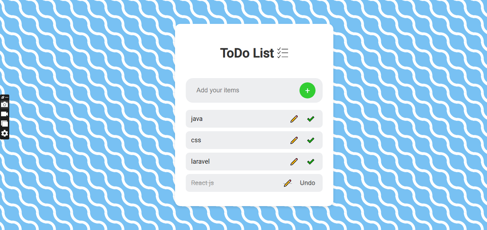

# ToDo List App

A simple and interactive ToDo List web application built using **React.js**. This project allows users to manage tasks, mark them as complete, and edit or delete tasks. The tasks are stored locally using `localStorage`, so your list will persist even if the page is reloaded.

## Features

- **Add New Tasks**: Add tasks to your to-do list.
- **Mark Tasks as Completed**: Mark tasks as completed and watch them move to the bottom.
- **Edit Tasks**: Update the content of existing tasks.
- **Delete Tasks**: Remove tasks from the list.
- **Persistent Data**: Your tasks are saved in `localStorage`, so they remain even after refreshing the page.
- **Responsive Design**: Works well on both desktop and mobile devices.

## Screenshots



## Demo

You can view the live demo of the project [here](#).

## Installation

To get started with this project locally, follow the steps below:

1. **Clone the repository:**

   ```bash
   git clone https://github.com/am94an/TodoList.git
   cd TodoList
   npm install
   npm start

## Technologies Used
React.js: JavaScript library for building user interfaces.
CSS: For styling the app (with custom styles).
localStorage: To persist tasks between page reloads.
